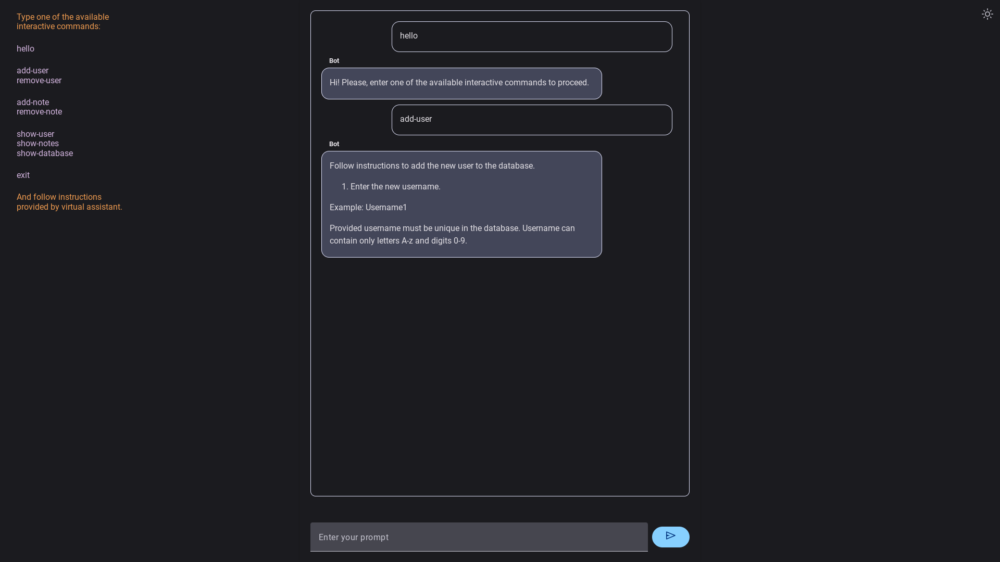

### Virtual assistant
:white_check_mark: Architecture: implemented as a **hierarchical state machine**. \
:white_check_mark: Backend: user data maintained in **NoSQL MongoDB** database. \
:white_check_mark: Fronend: written in Python using **Google Mesop**. \
:white_check_mark: Web Server: **WSGI GUnicorn**. \
:white_check_mark: Deployment: application **publically available** on the internet via secure https connection.

### Access
Open website [https://team-ai.cloud](https://team-ai.cloud)

Virtual assistant appears.

